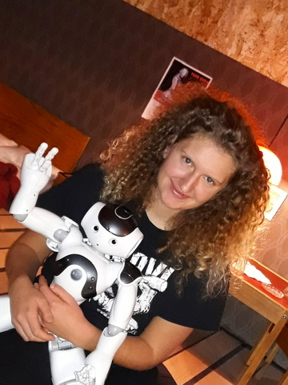
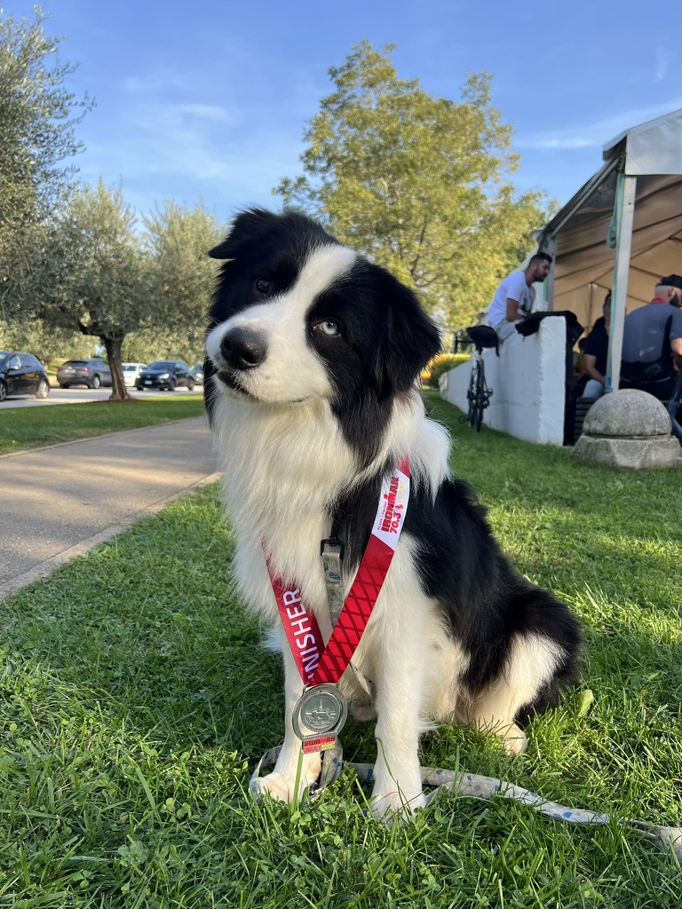

# Hi, I'm Gaja 👋

Software developer based in Vienna. Currently sending bugs to space a.k.a writing code for satellite thrusters.

## 🛠️ Some things I've built

- **[Mandelbulb Music Visualizer](https://github.com/pikanogavicka/mandelbulb_music_visualizer)** — a real-time audio visualizer that renders a 3D Mandelbulb fractal and animates it to music (or your mic), using GPU ray marching and live FFT analysis.
- **[Binary Neural Network from Scratch](#)** — a convolutional BNN built in pure NumPy, no PyTorch or TensorFlow. Forward pass, backprop, and the Adam optimizer are all hand-written, mostly so I could finally understand what a layer actually does.
- **[Rock Paper Scissors with Leap Motion](#)** — play rock-paper-scissors against the computer using real hand gestures, tracked by a Leap Motion sensor and classified with a hand-rolled KNN. Bonus points if you 3D print and conenct a robot hand, like I did.

## 🧵 A little bit about me

I bartended through my first year of university. Didn't teach me much about code, but it taught me patience, which turns out to be most of the job anyway.

In year two I landed a job at Institute Jozef Stefan, and it's still the best job I've ever had. Kids used to come through on tours, and (reasonably) nobody can explain machine learning to a nine-year-old. So my actual job became: make the robot entertaining. I taught a NAO humanoid robot to dance to Rasputin, the duck dance, and the Twist from Pulp Fiction.

My bachelor's thesis had me teaching that same robot to play tic-tac-toe. It didn't ship with inverse kinematics, so I wrote that myself, along with the vision system to actually see the board. Around the same time I also 3D-printed a robotic hand, wired it to an Arduino, and built a Rock-Paper-Scissors game you play with a Leap Motion sensor and your actual hand.

Sometimes I'd spend days getting some vision or kinematics algorithm to behave properly, and then watch the kids ignore all of it in favor of the button on the robot's chest that made it recite its IP address. They'd press that for ten minutes straight.

For my master's I fell for physically based rendering, spent a semester on it in Prague, and there I met my [favourite algorithm](https://cs.dartmouth.edu/~wjarosz/publications/novak18monte-sig.html). I know I'm a nerd, you don't need to tell me. But there just is something special about the clouds.

I'll try to clean up and upload the code for both theses to this GitHub at some point. No promises though. You know how it is: the deadline is a few months out, nothing works, you're pulling your hair out, and code quality is the last thing on your mind, you just want it to run once and be done. Coming back to it years later is a lot of work to make it presentable.

Military simulators after that, then medical robotics, then a move to Vienna, and now, satellite thrusters. If you want the rest of the employment history with the acronyms and tech stacks, that's what my CV is for. Ask and I'll send it over.

## 🐾 Off the clock

My border collie makes sure I never fully clock out. He's impossible to overstimulate and always up for a run or the park. Dogs are happy almost constantly, and I think about that more than is probably normal.

I also do triathlon, badly, in the sense that, like most triathletes, I don't really swim. There's a Greg LeMond line I think about a lot: "It never gets easier, you just go faster." Turns out that's also a pretty accurate description of software engineering. It doesn't get easier. You just get faster, and occasionally more impressive.
